<h1>Activité Pratique N°2 - Mise en oeuvre d'une architecture micro-services</h1>

une application basée sur une architecture micro-service qui permet de gérer les factures contenant des produits et appartenant à un client.

<h2>Première partie & Deuxième Partie</h2>
<h3>Customer-Service</h3>
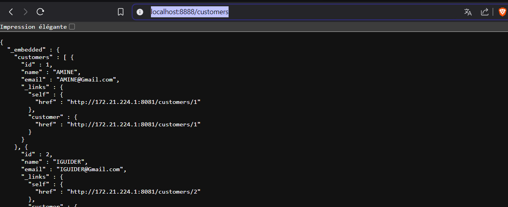
<h3>Inventory-Service</h3>

<h4>Billing-Service</h4>
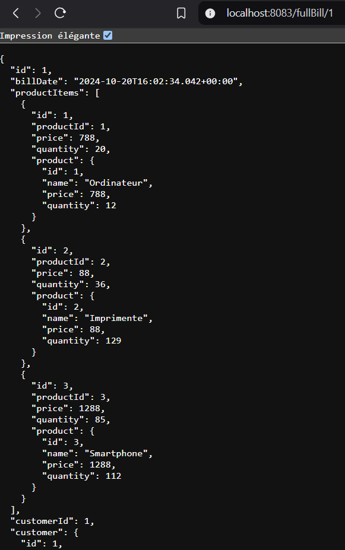
<h3>Spring Cloud Gateway</h3>
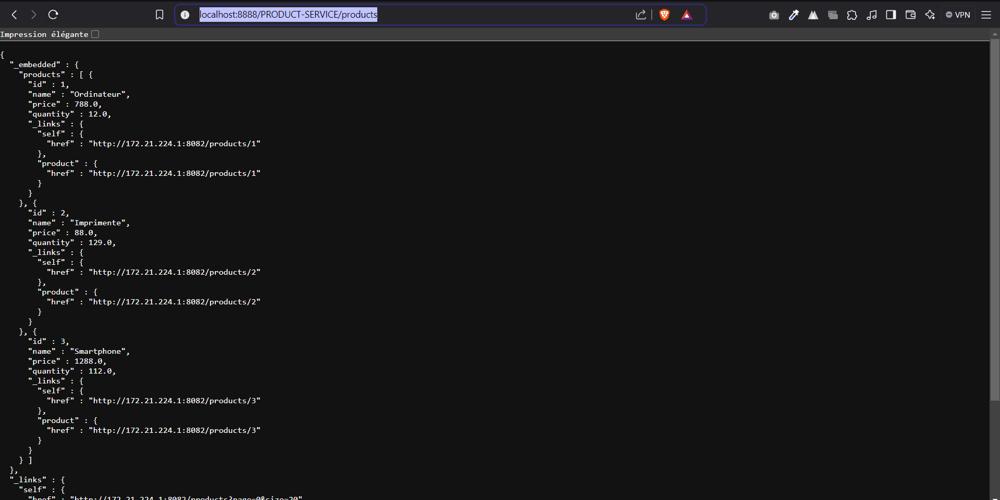
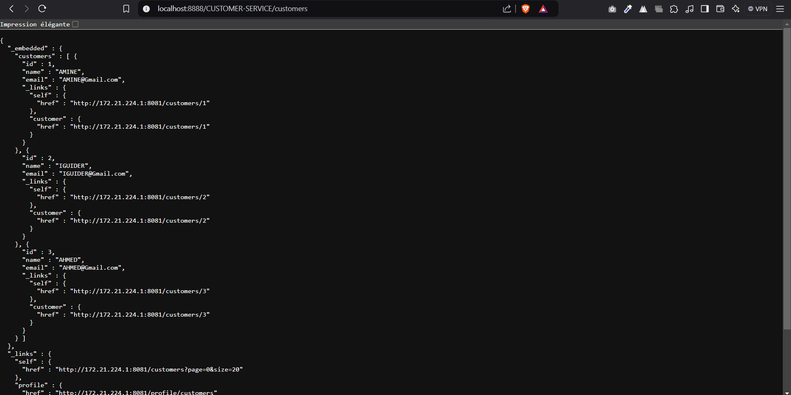
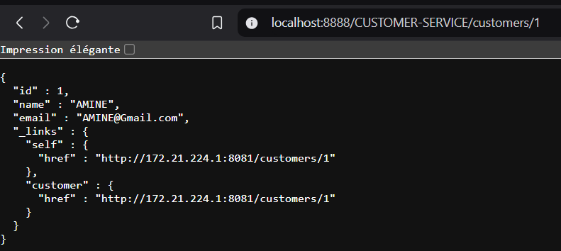
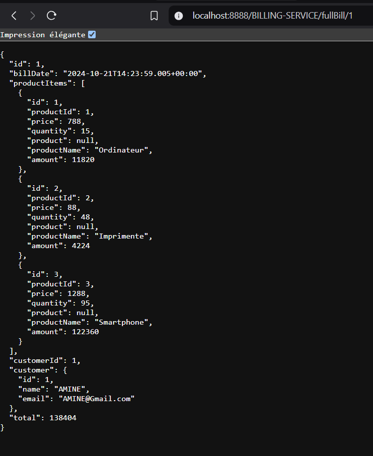
<h3>Eureka DiscoveryBilling-Service</h3>
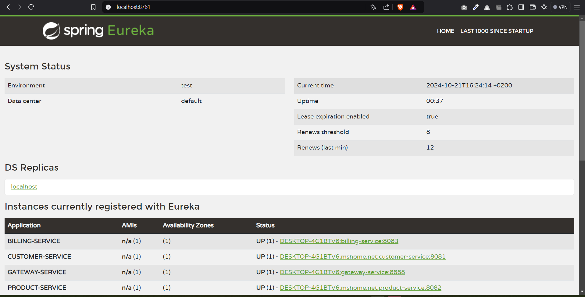
<h2>Troisième Partie : Angular</h2>
<h3>Products</h3>
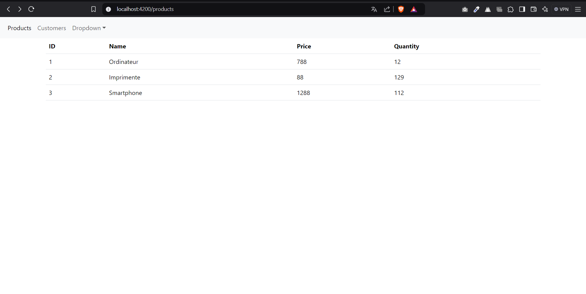
<h3>Customers</h3>
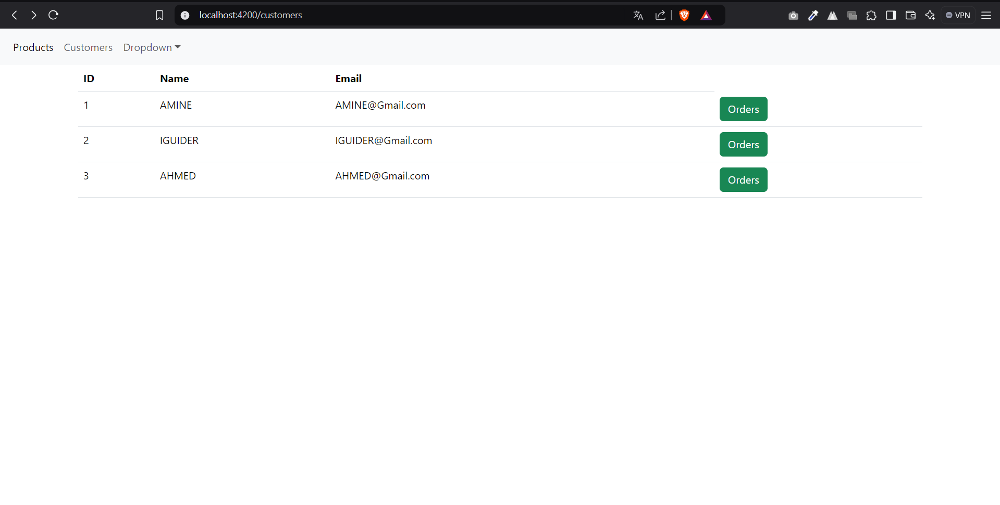
<h3>Bills</h3>
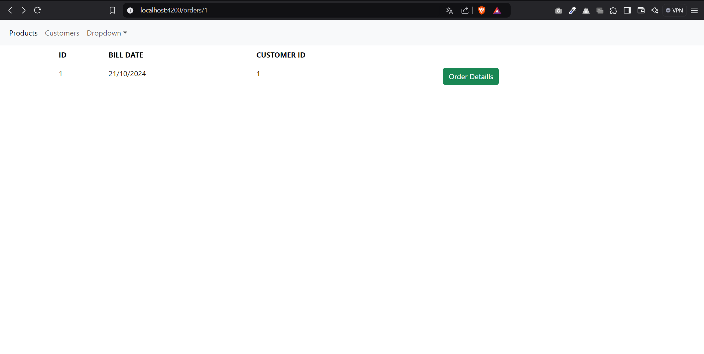
<h3>Bill Details</h3>
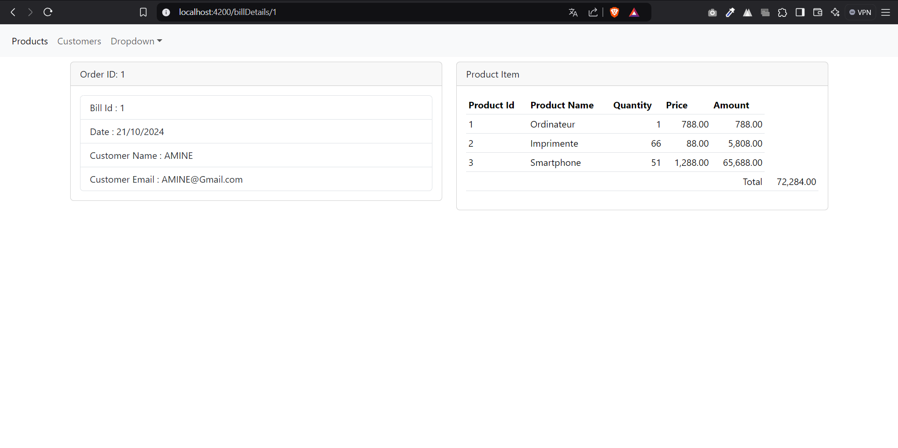

